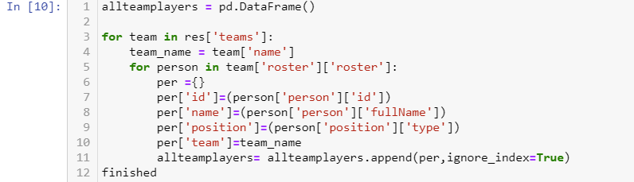
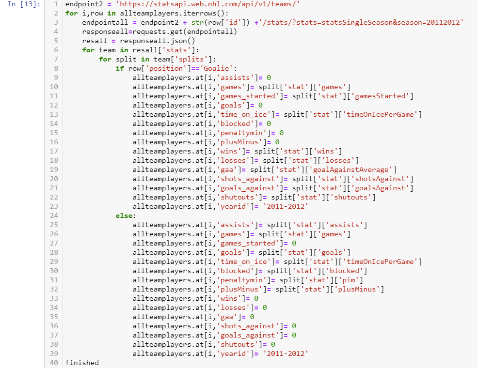
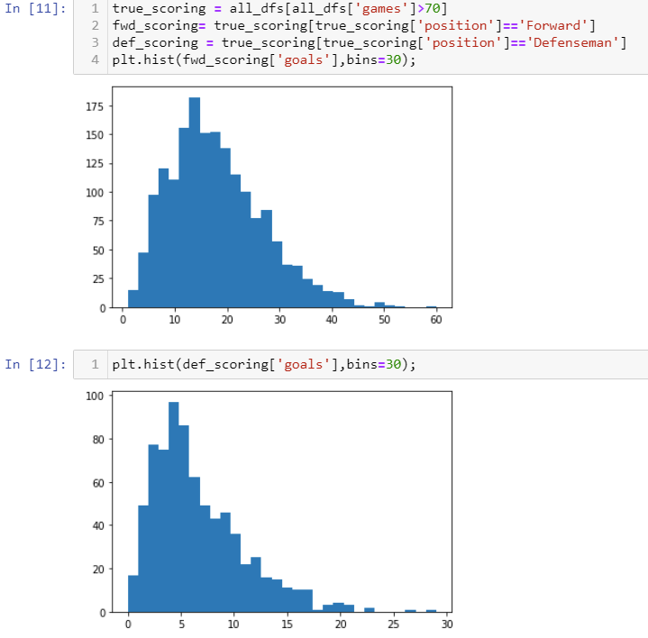
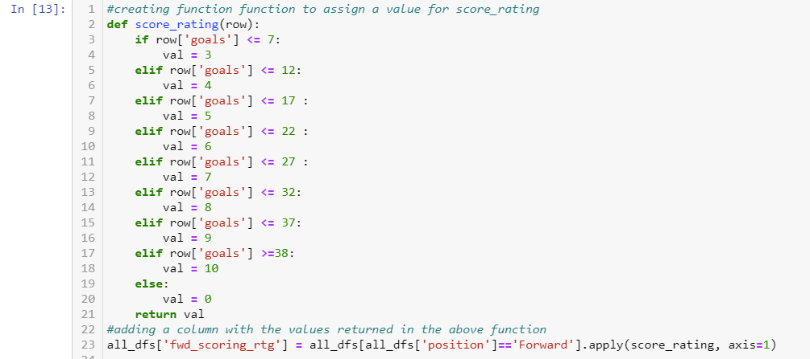
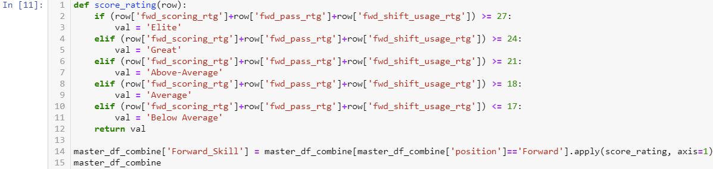
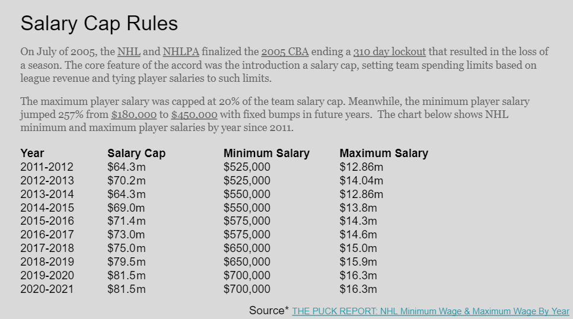

# 2011-2021 NHL Player Analysis

### The NHL?
The National Hockey League (NHL) was formed on November 26, 1917 and only had 8 teams. Since then the NHL has expanded and grown to now include 32 teams across Canda and The United States. Considered by most to premier ice hockey league in the world backed by its talent and revenue. This study will break down the last 10 years of Hockey by statistics and finances.

### Motivation
I have lived in the greater Nashville Area since 1997, I was 10. I grew up playing competitve sports and sport videos games in my childhood. I always have had an interest in understanding the how and why behind how major sport teams. In 1999 the city of Nashville enjoyed its first year as a NHL city and I was introduced to Hockey at the highest level. Since that time I have become and avid fan and played multiple NHL licensed game titles. Ive always enjoyed constructing theoretical teams through videogames respective Franchise game modes .

### The why?
The last two years the Tampa Bay Lighting  have won the league championship, Lord Stanley's Cup. How did this team win in a salary cap league 2 years with a static cap(pandemic)?How did they build their team to get to this point? Now, with my recent studies in data analytics I wanted analyze and present findings from real world sources.

#### I will be taking the last 10 years of hockey data, which will include player stats and salaries and develop a grading system. I will then use this data to determine the following:

* What are the average salaries of the each grade given

* How the top 4 teams of each year(ranked by playoff finish) built their teams.

* I will Define Salary Cap rules that have been collectively bargained.

###### I will provide interactive visualizations in Power Bi and/or Tableau that will be filterable by player, team, ratings

 
### Data search that is as Cold as Ice, was I willing to Sacrifice?
* When I started to gather raw data,I felt webscraping was the route I was going to have to take since I didnt find any APIs or free datasets in my search. Webscraping where it wasnt behind a login or was disallowed quickly became the norm and I worried that my capstone idea would be on ice. So before giving up I looked for an API once more. Turns out there is an undocumented NHL API that was created and luckily someone took upon themselves the arduous task of documenting multiple parameters.

A huge thanks and shout out to [Drew Hynes](https://github.com/dword4/nhlapi).

Another thanks to my instructors teaching me API basics so I could even pull what I needed.
    
    
### Getting the Raw statistical data
* So after reading the documention I found the API had mulitple arguments that I was going to use. One for teams rosters, and another for individual players that both fell directly after the orginal API endpoint. I found the player stats were nested in the players arguments but I needed their player id which was nested in the team rosters.
* Using Pandas in Python I first created a loop to run through the api and grab every team's roster with player ids in a given year to create a dataframe...

* I then used the itterows function to loop throught my created dataframe and grab the stats for each respective year...

###### I used this process for each year starting in 2011-12 and ending in 2020-21 and saved each respective year to a csv...

### Creating a Grading System
* Since there are mulitple stats that were pulled I decided creating a grading system for players would help paint a more clear picture of player abilities compared to the league. I created histograms for each respective stat to get a more accurate gauge on how to base my ratings..

* I then created a function to apply the ratings to the dataframe...

* I finally took those new ratings and gave a skill value to each new column based on their total of multiple ratings

### Adding the financial data

* I ended up having to get a yearly subscription to [sportac](https://www.spotrac.com) to pull all of my financial data. It was simple copy and paste from the site sorted by year and merged that with my rating dataframe. If a players cap hit a Nan value then they were in the minors so their cap hit didnt count against their respective teams total cap.

* I found a breakdown of the salary cap and included it in my presentation...

### Dashboard
 I finally had all my data cleaned and analyzed. I chose to create an interactive Dashboad using Tableau as my classed covered two data visualization programs and I have learned to love Tableau. I envision this dashboard to be used during the offseason by front offices to target players to help supplement the teams roster after the annual draft, or a fan wanting to know how their team faired compared to other teams. I wanted make sure I would Include the following features...
 * Top teams based on a year filter
 * Positional salary breakdown based on a team and year filter
 * Average salary based on position for each year]
 * Search bar for individual player
 * Cap Hit slider to select players based their cap hit range
 * Filter player skill rating
 * Player ratings and individual stats based on a team and year filter
 
 You can see the dashboard [here](https://public.tableau.com/app/profile/jonathan.lloyd5465/viz/NHLTableau/Dashboard1?publish=yes)

